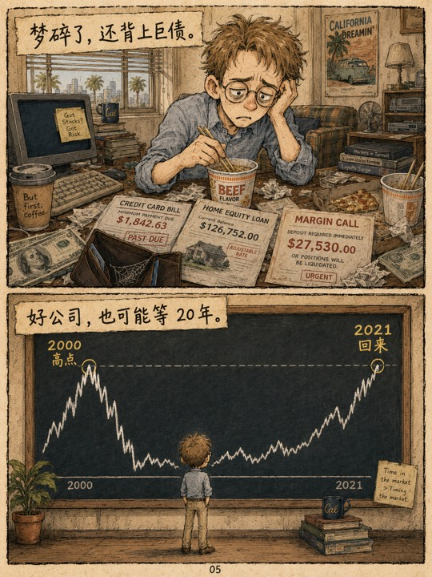

# 漫画工作流 Codex Skill

这个仓库提供一个 Codex skill：`comic-workflow`。它会根据用户创意制作 3:4 竖版中文手绘教育漫画，并把脚本、设定、提示词、生成图片和清单整理到用户指定目录。

图片生成阶段优先使用 Codex Chrome 插件自动化用户本机 Chrome 中的 ChatGPT 网页，这样可以复用登录态、上传参考图并批量下载成品图；Browser 插件可在不依赖本机 Chrome 登录态时作为备用方式。

## 效果展示

<p>
  
  
  
  
  
  
  
</p>

## 安装

### 前置条件

- Codex 已启用 Chrome 插件；建议同时启用 Browser 作为备用能力。
- 本机 Chrome 可以访问并登录 `https://chatgpt.com/`。
- ChatGPT 账号具备图片生成功能。

告诉你的 agent：

> Install the `comic-workflow` skill from `github.com/SyMind/codex-comic`.

或者直接运行安装命令：

```bash
# 项目级安装
npx skills add SyMind/codex-comic

# 全局安装
npx skills add SyMind/codex-comic -g
```

也可以手动克隆到 Codex skills 目录：

```bash
git clone https://github.com/SyMind/codex-comic.git ~/.codex/skills/comic-workflow
```

安装后，通过 `$comic-workflow` 调用。

## 使用方式

安装后，直接用自然语言告诉 agent 你想做什么漫画，并说明主题、页数、受众、风格或输出目录：

> 使用 `$comic-workflow` 创作一部 6 页中文科普漫画，解释 AI 泡沫和 2000 年互联网泡沫的相似点，保存到 `./output`。

> 把这篇产品文章改成 4 页手绘教育漫画，面向非技术用户，风格轻松一点，保存到 `./output`。

> 做一组 3:4 竖版漫画，讲清楚新员工 onboarding 流程，需要角色一致、每页有分镜和中文说明。

> 根据我的课程大纲生成一部短篇条漫，先写脚本和角色设定，再生成参考图和最终页面。

agent 会：拆解主题 → 编写按页脚本 → 建立角色/场景/风格设定 → 生成并保存提示词 → 选择 Chrome/Browser 中最高效可用的浏览器控制方式 → 操作 ChatGPT 生成参考图 → 并发生成每一页漫画 → 下载图片 → 整理 `manifest.json` 和生成记录。

## 漫画生产工作流

`comic-workflow` 的核心不是简单生成一张图，而是把“一个创意”推进成可复用、可追踪、可批量生成的漫画项目。它会把创作过程拆成脚本、设定、提示词、参考图、最终页面和生成记录，让每一步都有文件沉淀。

1. **创意拆解**：把用户给出的主题、受众和表达目标整理成适合漫画呈现的叙事结构。
2. **按页脚本**：为每一页写故事节拍、分镜布局、镜头、动作、对白/旁白/音效字和连续性备注。
3. **角色与场景**：沉淀角色外观、服装、表情、道具、场景空间、光线、氛围和禁忌，减少多页漫画中的漂移。
4. **统一风格策略**：固定 3:4 竖版、中文手绘教育漫画风格、阅读方向和文字策略；用户不指定画风时使用内置默认画风。
5. **独立提示词归档**：为角色参考图、场景参考图和每一页漫画分别生成可复用提示词，保存到 `prompts/`。
6. **参考图先行**：先通过 ChatGPT 生成角色和场景参考图，再把它们作为后续页面的一致性依据；角色和场景参考图也可以并发生成。
7. **并发图片生成**：角色、场景和最终漫画页都采用“一个生成任务一个全新 ChatGPT 对话”的方式，可以同时打开多个新对话并发生成，提高多图产出效率。
8. **页面质量约束**：每页保持角色/场景连续性、3:4 比例和指定分镜布局；画面内不出现页码、页脚编号、角标编号或无关文字。
9. **自动整理交付物**：下载后的参考图、最终页面、日志和 `manifest.json` 会按目录归档，方便复查、修改和继续创作。

## 适合什么场景

- 把复杂概念、技术知识或商业案例改写成更容易传播的教育漫画。
- 为课程、公众号、演示文稿或社媒内容制作短篇图文故事。
- 需要多页漫画保持角色、场景和画风一致，而不是每页重新即兴生成。
- 想保留完整提示词、参考图和生成记录，方便后续复用、二次修改或团队协作。
- 希望批量生成多页漫画，同时减少手动管理文件和命名的成本。
