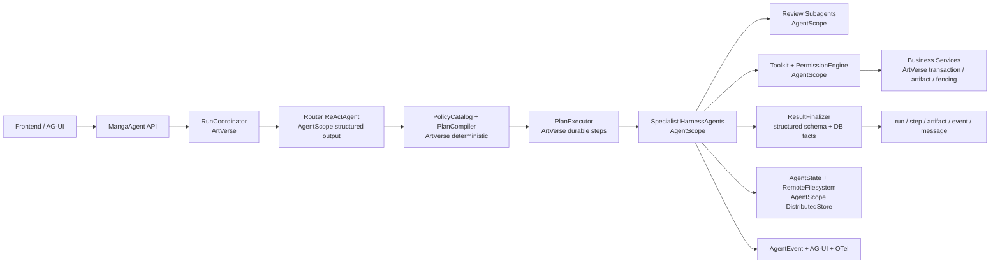

# ArtVerse 多智能体稳定性优化设计（AgentScope 2.0 GA 对齐版）

> 状态：设计提案  
> 日期：2026-07-15  
> 输入会话：`019f5ff0-4581-7070-8534-11aa6e1ea3d4`（“设计多智能体稳定方案”）  
> 适用范围：漫画 Agent 的路由、上下文、工具、HITL、Review 子智能体、Director、结果校验、状态恢复与观测  
> 核心约束：优先复用 AgentScope 2.0 GA，禁止自研通用 Agent 基础设施；ArtVerse 只保留业务事务、安全边界和可审计状态。

## 1. 结论摘要

原会话提出的四条主线——确定路由、强上下文、工具可观测、最终输出校验——方向正确，当前仓库也已实现其中相当一部分。但实现过程中把一些本应由 AgentScope 承担的通用能力再次封装成了 ArtVerse 自有状态机，导致“组件很多、闭环仍不完整”。

当前最需要处理的不是继续增加 `Validator`、`Status`、`Tracker`，而是重划职责边界：

- AgentScope 负责 ReAct 循环、结构化输出、AgentState、分布式 workspace、上下文压缩、工具权限、HITL 暂停/恢复、子智能体、Typed Event、AG-UI 和 OpenTelemetry。
- ArtVerse 负责用户/章节授权、能力目录、确定性业务计划、run/step/artifact 持久化、幂等、租约、fencing、章节版本、事务提交和最终事实校验。
- 模型只表达意图和生成候选内容，不生成安全策略，不决定可用工具，不决定最终是否“执行成功”。

建议先完成 4 个 P0 止血项：

1. 从 AgentScope Toolkit 中彻底移除三个 legacy 写工具，不能再依赖执行后的契约校验拦截。
2. 将 assistant 回复保存移到工具契约与结果事实校验之后，禁止“先保存成功话术、后发现执行失败”。
3. 将 HITL 恢复改成 AgentScope 原生 `ConfirmResult` / `ExternalExecutionResultEvent`，禁止重新拼消息从头跑 Agent。
4. 升级 `agentscope.version` 从 `2.0.0-RC4` 到 `2.0.0` GA，再使用其 DataBlock、结构化输出 + 工具、分布式状态、权限、子智能体事件和 AG-UI 能力。

## 2. 当前实现基线

### 2.1 已实现且应保留的部分

| 模块 | 当前实现 | 判断 |
|---|---|---|
| 业务路由 | 5 条 route、`MangaWorkflowRouter`、pre-filter、能力目录、结构化分类 | 保留路由边界，简化模型输出 |
| 计划安全 | `ExecutionPlanCompiler`、`ExecutionPlanValidator`，限制 3 步、禁止递归 Director、多写步骤 | 保留；这是业务确定性，不是重复造轮子 |
| 专家节点 | Conversation / Creative / Storyboard / Review / Director 节点与注册表 | 保留 route 级抽象，缩小节点职责 |
| 写入安全 | 两阶段 storyboard artifact、唯一新写入口 `commit_storyboard`、章节版本、fencing、工具幂等 | 强保留；这是 ArtVerse 的事务核心 |
| 运行持久化 | run、step、artifact、event、usage ledger、outbox、lease/watchdog | 强保留；这是业务事实面 |
| AgentScope 接入 | `HarnessAgent`、Redis `AgentStateStore`、RemoteFilesystem、Compaction、Toolkit group、RuntimeContext | 继续使用，但改成 GA 原生组合方式 |
| 多智能体 Review | 4 个 AgentScope `SubagentDeclaration` | 保留 AgentScope 子智能体，移除手写调度假设 |
| 工具审计 | `AgentToolAuditService`、`AgentRunToolStatus`、`manga_agent_run_events` | 保留业务审计结果，替换热状态与通用事件跟踪 |
| RAG | `KnowledgeService`、知识快照、context hash、运行关联 | 保留知识业务库，改用 AgentScope DataBlock/RAG 接口注入 |
| Skills | 发布态 skill、版本、checksum、用户设置、AgentScope SkillRepository 适配 | 保留发布/授权规则，底层仓库优先换官方实现 |

### 2.2 原会话方案的落地状态

| 原方案项 | 当前状态 | 实际问题 |
|---|---|---|
| `RoutingDecision` 扩展为执行契约 | 已实现 | tool/context/output contract 仍由模型输出，再由服务端比对；策略所有权放错了 |
| `RouteContractValidator` | 已实现 | 大量字段可由 record 默认值自动补齐，增加路由失败面，却没有增加业务表达力 |
| 上下文 snapshot/hash/warnings | 已实现 | RAG 在 snapshot 之后独立召回，hash 不含知识快照；同一请求会同时出现“缺知识”和实际知识块 |
| 工具调用持久化 | 部分实现 | 工具事件已进入 run events，但执行判断仍依赖 local + Redis TTL 的 `AgentRunToolStatus` |
| `ToolExpectation/Verifier` | 已实现 | 校验发生在工具执行和回复保存之后，不能阻止 legacy 工具已经产生的写入 |
| `WorkflowResultVerifier` | 未实现 | `outputContract` 路由后没有进入最终结果闭环 |
| Director 基于 verified facts 汇总 | 部分实现 | 仍使用原始文本 handoff，且所有只读步骤失败都可被跳过 |
| Guard 指标 | 部分实现 | 有路由、review、tool contract 指标，但没有完整 AgentScope trace 与事件关联 |
| 乱码清理 | 不应实施 | 源文件按 UTF-8 读取中文正常；旧会话观察到的是 PowerShell 默认解码误差 |

### 2.3 已验证状态

2026-07-15 已执行：

```text
mvn -q -DskipTests compile
mvn -q -Dtest=MangaWorkflowRouterTest,ExecutionPlanCompilerTest,
ExecutionPlanValidatorTest,ToolContractVerifierTest,MangaWorkflowOrchestratorTest,
MangaDirectorAgentNodeTest,MangaAgentExecutionSupportTest,AgentSessionHydratorTest,
AgentRunToolStatusTest,AgentToolAuditServiceTest test
```

编译及以上聚焦测试通过。这只能证明当前代码路径自洽，不代表本文列出的跨阶段、跨副本和失败时序已经被覆盖。

## 3. 缺陷清单

### 3.1 P0：可能导致错误写入或错误成功语义

#### P0-1 legacy 写工具实际仍对 Storyboard Agent 可见

`AgentToolGroupSupport` 将整个 `MangaStoryboardTools` 对象注册到 `storyboard-tools`，因此下面三个兼容工具仍可被模型调用：

- `generate_storyboard`
- `save_storyboard`
- `save_structured_storyboard`

`ToolContractVerifier` 虽将它们列为 forbidden，但校验发生在工具返回之后。三个工具已经可以创建并提交 artifact，事后抛错无法回滚已经完成的独立业务动作。

结论：禁止工具必须“不注册”或在 AgentScope PermissionEngine 中 `DENY`，不能只做 post-check。

#### P0-2 回复先保存，契约后校验

当前节点调用顺序是：

```text
executeRequest / executeStreamedRequest
  -> completeRequest
     -> saveReply
  -> verifyToolContract
```

如果最终发现缺少 `commit_storyboard`、调用禁用工具或工具失败，运行会失败，但 assistant 成功话术已经写入会话。缓存回复逻辑还可能让后续请求优先读到这条不可信回复。

结论：回复与 run terminal status 必须在所有事实校验通过后一次性提交。

#### P0-3 HITL 没有按 AgentScope 原生协议恢复

当前 `ask_user` 标记为 AgentScope external tool，但恢复时主要通过 `resumeMessage(...)` 重构普通用户消息，再以相同 requestId 重新执行 route/node。没有持久化并回传原生 `replyId + ToolUseBlock` 对应的：

- `ConfirmResult` / `UserConfirmResultEvent`
- `ToolResultBlock` / `ExternalExecutionResultEvent`

这意味着恢复行为是“重新请求”，不是“从暂停工具调用处继续”，可能重复模型调用、重复 draft、丢失 pending tool 状态或重新路由。

#### P0-4 最终成功事实没有服务端权威来源

当前只检查回复非空和部分 tool event，没有检查：

- committed artifact 是否属于当前 run/step；
- artifact 是否仍为 `COMMITTED`；
- chapter version 是否按预期增长；
- fencing token 是否仍有效；
- reply 中的 scene count / saved 结论是否与数据库一致；
- 只读 route 是否产生了任何 mutating audit。

`RoutingDecision.outputContract` 目前只参与路由校验，没有参与结果校验。

### 3.2 P1：恢复、上下文和多智能体可靠性缺陷

#### P1-1 使用预发布 RC4，错过 GA 稳定性能力

项目锁定 `2.0.0-RC4`。AgentScope Java `2.0.0` GA 已于 2026-07-10 发布，并在 RC4 之后加入或修复了：

- 带工具的原生结构化输出；
- provider 统一 DataBlock；
- stateless Agent 与跨副本 state reload；
- 子智能体 RuntimeContext/middleware 传播；
- AgentResultEvent / stream event 顺序；
- orphan subagent 中断；
- OpenTelemetry 上下文传播；
- 分布式 store 一体化配置。

这些正好覆盖当前稳定性薄弱点，因此继续在 RC4 上补自有 wrapper 性价比很低。

#### P1-2 模型生成了本应由应用生成的 route contract

Router prompt 要求模型输出 `expectedToolPolicy`、`requiredContextFields`、`outputContract`，服务端随后再计算期望值并比对。模型并不了解真实 Toolkit、部署开关、章节状态和授权状态，因此这些字段不是模型事实。

正确边界应为：模型只输出 intent/capability/confidence/clarification；应用的 `WorkflowPolicyCatalog` 根据 route、capability、feature flag 和用户权限编译执行契约。

#### P1-3 上下文存在三个互相竞争的来源

当前同一轮可能同时携带：

- PostgreSQL conversation history；
- AgentScope AgentState history；
- workflow snapshot 中的 `conversation_summary`；
- workspace `KNOWLEDGE.md`；
- `get_chapter_context` 工具返回；
- XML 文本形式的知识召回块。

它们没有明确的优先级和版本关系，模型可能同时看到新旧 storyboard。

#### P1-4 RAG 与 context snapshot 不是同一个原子快照

`MangaWorkflowContextAssembler` 先生成 context hash 并固定加入 `knowledge_recall_missing`，`MangaAgentExecutionSupport` 之后再做知识召回。run 持久化记录虽可后补 knowledge hash，但实际传给 Agent 的 chapter snapshot 仍可能包含矛盾 warning。

#### P1-5 Director 在写步骤后继续复用旧 snapshot

Director 的多个 step 共享最初的 `MangaWorkflowContextSnapshot`。Storyboard commit 后，Review step 虽可通过工具读到新数据库事实，但注入的 snapshot 仍是旧 scene count / old storyboard excerpt，形成同一 prompt 内的版本冲突。

#### P1-6 Review 子智能体跟踪器误解 `source`

AgentScope 子智能体事件 `source` 是类似 `main/researcher` 的路径。当前 tracker 以 `expected.contains(source)` 做精确匹配，容易漏掉子事件；同时以 `maxConcurrency >= expected.size()` 作为完整性条件，把“全部完成”与“必须在同一瞬间并发 4 个”绑定在一起。

#### P1-7 子智能体模型预算没有逐次计量

`AgentBudgetService.consumeModelCall` 在 gateway 顶层调用一次。Review 内部 4 个 subagent 的实际 model call 不会经过 gateway，因此 `reviewMaxModelCalls=13` 不能代表真实消耗。Tool 调用也散落在每个工具 wrapper 中，无法统一覆盖子智能体与未来 MCP 工具。

#### P1-8 流式最终回复靠拼接 delta，而不是 AgentResultEvent

`executeStreamedRequest` 通过拼接所有 `TextBlockDeltaEvent` 构造最终回复，`AgentResultEvent` 只被映射为“reply_ready”提示，没有读取最终 `Msg`。在多轮 ReAct、子智能体转发、summary block 或 provider 重放场景中容易出现重复、缺块或把中间文本当最终结果。

#### P1-9 取消没有调用 AgentScope 原生 interrupt

当前取消主要修改 `AgentRunToolStatus.cancelled`，依赖订阅侧抛异常结束。应该同时对准确的 `(userId, sessionId)` 调用 AgentScope `interrupt`，让 framework 中止模型、工具和 orphan subagent，并保存可恢复状态。

### 3.3 P2：维护成本与重复建设

- `AgentScopeAgentFactory` 以 user/story/chapter/conversation/workspace 作为 Caffeine key；AgentScope 2.0 GA 的 Agent 已可按 RuntimeContext 选择 session 并安全复用，应缩小到 role/model/prompt/skill/permission 等不可变配置。
- `AgentSessionHydrator` 以 state 是否存在决定是否重发 PostgreSQL history，没有 revision/watermark，无法检测部分 state、过期 state 或投影落后。
- `serverDataBlock()` 手写 XML 包 JSON；AgentScope 已有原生 `DataBlock`。
- `MangaReviewSubagentTracker`、手写 AG-UI 映射、工具通用事件审计、热状态机与 AgentScope Typed Event/AG-UI/Otel/AgentState 重叠。
- `PostgresAgentWorkspaceStore` 是自定义 `BaseStore`；AgentScope GA 已提供 Redis DistributedStore 和可识别 PostgreSQL 方言的 JDBC Store。
- `ArtVerseSkillRepository` 可逐步迁移到官方 PostgreSQL Skill Repository；ArtVerse 只保留发布、授权和 capability allowlist。
- `countScenes` 通过统计引号估算 scene 数，不是权威领域解析。
- run attributes 深合并会在 resume/retry 时重复追加 list，适合诊断，不适合作为执行事实源。

## 4. 目标职责边界



### 4.1 AgentScope 必须负责

| 能力 | 使用 AgentScope 组件 |
|---|---|
| 单 Agent 推理与工具循环 | `ReActAgent` / `HarnessAgent` |
| 结构化模型输出 | `call(..., OutputClass, RuntimeContext)`；带工具场景使用 GA 原生能力 |
| 会话运行状态 | `AgentStateStore`，按 `(userId, sessionId)` 自动装载/保存 |
| 长上下文 | Compaction、ToolResultEviction、Memory |
| 动态调用上下文 | `RuntimeContext` |
| 工具清单与分组 | `Toolkit` / tool groups |
| 写工具审批 | `PermissionEngine`、`PermissionDecision`、`RequireUserConfirmEvent` |
| 外部人工输入 | external tool + `RequireExternalExecutionEvent` / `ExternalExecutionResultEvent` |
| 子智能体 | Harness subagent、`agent_spawn` / `agent_send`、source path |
| 流式事件 | Typed `AgentEvent`、`AgentResultEvent` |
| 前端协议 | `agentscope-extensions-agui` 的 `AguiAgentAdapter` |
| 链路追踪 | `OtelTracingMiddleware` |
| 分布式 workspace/state | `DistributedStore` + `RemoteFilesystemSpec` |
| Skills 物理仓库 | 官方 PostgreSQL Skill Repository，或官方 workspace skill loader |

### 4.2 ArtVerse 必须负责

| 能力 | 原因 |
|---|---|
| route/capability 目录与授权 | 业务能力和产品开关只能由应用决定 |
| Director plan 最大步数、单写约束、required/optional | 属于业务执行策略，不可交给模型 |
| 用户、故事、章节可见性 | 服务端安全边界 |
| artifact schema/evaluator/commit | 领域事务 |
| requestId 幂等、outbox、lease、fencing、chapter version | 数据一致性 |
| run/step/artifact/message 持久化 | 产品查询、回放与审计 |
| 最终事实校验与 terminal 状态 | 成功不能由模型自证 |

### 4.3 明确不做

- 不再新建 ArtVerse 自有 Agent memory、subagent scheduler、permission engine、HITL protocol、AG-UI adapter 或 tracing framework。
- 不把有事务副作用的 Director 执行完全交给自主 Agent；AgentScope Plan Mode 可用于只读规划，但不能替代 ArtVerse 的持久化业务计划。
- 不让模型动态注册工具、改变 capability、创建新 route 或绕过 `commit_storyboard`。
- 不删除现有 idempotency、lease、fencing、artifact、outbox；它们不是 AgentScope 的重复能力。

## 5. 分模块优化设计

## 5.1 模块 A：AgentScope 2.0 GA 基线

### 目标

先把所有后续设计建立在生产版 SDK 上，避免继续围绕 RC4 行为写兼容代码。

### 方案

1. 将 `agentscope.version` 升级为 `2.0.0`。
2. 按 GA 模块化要求显式增加实际使用的 model provider extension；当前 OpenAI-compatible BYOK 路径使用官方 OpenAI model extension。
3. 增加 `agentscope-extensions-agui`；若 controller 形态允许，再评估 Spring Boot starter。
4. 保留 `agentscope-extensions-redis`，用官方 `DistributedStore` 同时提供 AgentState 与 workspace BaseStore。
5. workspace 默认采用：

```text
RedisDistributedStore
  + RemoteFilesystemSpec(IsolationScope.SESSION)
  + stable agent name
  + RuntimeContext(userId, sessionId)
```

6. 如果运维明确要求 workspace 落 PostgreSQL，使用 AgentScope 官方 JDBC Store（可识别 PostgreSQL 方言），迁移并退休 `PostgresAgentWorkspaceStore`，不要继续维护自定义 CAS BaseStore。
7. `AgentScopeAgentFactory` 改为角色注册表：cache key 只保留 taskType、model config/hash、prompt version、skill version、permission profile。story/chapter/conversation 全部进入 RuntimeContext/session/workspace isolation。

### 验收

- 相同 Agent 实例可并发服务不同 session；相同 session 自动串行。
- 任意副本可继续同一 session。
- RC4 后删除的兼容 API 不再出现在业务代码。
- 所有 provider、DataBlock、structured output、subagent、AG-UI 集成测试通过。

## 5.2 模块 B：确定性路由与计划编译

### 新的模型输出

模型只返回：

```java
record RouterIntentOutput(
    List<String> intents,
    Set<MangaWorkflowCapability> requiredCapabilities,
    double confidence,
    boolean needsClarification,
    String reasonCode,
    List<MangaWorkflowRoute> suggestedSteps
) {}
```

删除模型输出中的：

- `expectedToolPolicy`
- `requiredContextFields`
- `outputContract`
- `fallbackReason` 的安全策略细节

### 应用编译契约

新增或重构为单一 `WorkflowPolicyCatalog`：

```text
(route, capabilities, user policy, feature flags)
  -> allowedToolGroups
  -> permissionProfile
  -> requiredContextSchema
  -> outputSchema
  -> retryPolicy
  -> fallbackPolicy
```

`ExecutionPlanCompiler` 继续是唯一 plan 创建者。建议给 step 增加：

- `required`：失败是否允许降级；
- `inputSchema` / `outputSchema`；
- `expectedArtifactType`；
- `contextVersion`；
- `maxModelCalls` / `maxToolCalls`；
- `permissionProfile`。

### 路由顺序

```text
输入结构校验
 -> 高精度 deterministic pre-filter
 -> AgentScope structured router
 -> capability/availability 校验
 -> 应用编译 policy contract
 -> 置信度/HITL
 -> ExecutionPlanCompiler
```

### fallback

- unsupported capability 不应让普通 Conversation Agent自由回答；应注入明确的 server-owned `fallbackReason`，由只读模板或受限 Conversation 输出“当前能力不可用”。
- 写请求低置信度进入原生 HITL，不静默改为写或自由对话。
- read-only 低置信度可回到 Conversation，但必须携带 `reasonCode`，并禁止声称执行动作。

## 5.3 模块 C：上下文、RAG 与会话状态

### 单一上下文包

将当前分散的 snapshot + RAG + workspace sync 合并为每 step 一个不可变 `ContextEnvelope`：

```java
record ContextEnvelope(
    String schemaVersion,
    long chapterVersion,
    String contextHash,
    Long knowledgeSnapshotId,
    String knowledgeHash,
    Set<String> presentFields,
    Set<String> missingRequiredFields,
    ChapterContextData chapter,
    List<KnowledgeRef> knowledgeRefs
) {}
```

构建顺序必须是：

```text
读取 chapter/character/images/storyboard
 -> 完成 RAG recall 并固化 knowledge snapshot
 -> 按 route policy 检查 required fields
 -> canonical JSON
 -> 计算 contextHash
 -> 持久化 run/step context reference
 -> 通过 AgentScope DataBlock 注入
```

### 使用 AgentScope DataBlock

删除 `<artverse_server_data_block>` XML 字符串。使用原生 `Msg` + `DataBlock` 表达：

- `chapter_snapshot`
- `knowledge_recall`
- `verified_previous_step_result`
- `route_fallback_reason`

DataBlock 是数据，不混入第一条 user message，不允许用户文本覆盖。

### 会话状态所有权

- AgentScope `AgentState` 是 Agent 推理上下文的运行时事实源。
- PostgreSQL messages 是产品展示、审计和灾备投影。
- 新请求只向 AgentScope 发送本轮新消息，不再每轮重复注入全部数据库历史。
- 当 AgentState 不存在时，用 `agent.observe(persistedHistory)` 做一次性 bootstrap，并记录 bootstrap message watermark；不要通过 `AgentSessionHydrator` 每轮改写输入列表。
- Redis state 丢失时从 PostgreSQL 恢复；恢复后继续使用相同 `(userId, sessionId)`。

### 数据新鲜度

- 每个 Director step 单独生成 ContextEnvelope。
- 写 step 完成后强制以新 chapter version 重建上下文，Review 不得继承 commit 前 snapshot。
- `get_chapter_context` 返回 `chapterVersion/contextHash`，模型看到的 DataBlock 与工具结果必须可比对。

### Context hash

- 对 canonical JSON 计算 SHA-256，禁止简单无分隔字符串拼接。
- hash 必须包括 chapter version、artifact/version、knowledge snapshot/hash、required fields 和 prompt-visible data。
- scene count 使用领域结构解析，不统计引号。

## 5.4 模块 D：Toolkit、权限与写入安全

### 工具最小暴露

建议拆分工具类：

```text
MangaContextTools
StoryboardDraftTools
  - draft_structured_storyboard
StoryboardCommitTools
  - commit_storyboard
LegacyStoryboardCompatibilityService
  - 不注册到任何 AgentScope Toolkit
```

Storyboard Agent 的 Toolkit 只允许 context + draft + commit。Director、Review、Conversation、Creative 永远看不到写工具。

### AgentScope PermissionEngine

| 角色 | PermissionMode | 规则 |
|---|---|---|
| Router | `DONT_ASK` | 无业务工具 |
| Conversation/Creative/Review | `EXPLORE` | 只允许 read-only context/RAG |
| Storyboard | `DEFAULT` | allow context/draft；commit 按输入与章节状态 ALLOW 或 ASK；legacy DENY |
| Director summary | `EXPLORE` | 只读 verified step data |

`commit_storyboard` 应实现 AgentScope tool permission check：

- artifact 不属于当前 run/step：DENY；
- artifact 未验证：DENY；
- chapter 已有 storyboard 且未授权覆盖：ASK；
- fencing/lease/chapter version 过期：DENY；
- 全部满足：ALLOW。

权限是执行前门禁；artifact service 仍需在事务内重复校验，防止 TOCTOU。

### 工具结果

工具只返回小型权威事实：

```text
artifactId, artifactStatus, chapterVersion,
sceneCount, committed, resultHash, auditId
```

完整 scenes 留在 artifact 表，不塞入 model context。启用 AgentScope ToolResultEviction/compaction，避免大结果拖垮后续轮次。

### 工具审计

- 通用 model/tool span 使用 `OtelTracingMiddleware`。
- 通用 tool start/end 由 AgentScope event projector 持久化，不再要求每个工具手写相同 wrapper。
- mutation audit、idempotency key、artifact、chapter version、fencing 必须在业务事务内记录，这是 ArtVerse 审计。
- 逐步缩减 `AgentToolAuditService` 为 mutation-domain audit；删除通用耗时/成功日志重复层。

## 5.5 模块 E：原生 HITL、恢复与取消

### 两类 HITL

1. 写工具审批：AgentScope PermissionEngine `ASK`。
2. 非工具业务选择：AgentScope external tool，例如“选择创意方向”。

### 暂停持久化

run 需要持久化：

```text
sessionId
replyId
pauseType = USER_CONFIRM | EXTERNAL_EXECUTION
pendingToolCallsJson
pauseCreatedAt
permissionSnapshot/version
```

### 恢复

```text
前端答案
 -> 校验 run 仍 WAITING_USER、用户和 session 一致
 -> 构造 ConfirmResult 或 ToolResultBlock
 -> UserConfirmResultEvent / ExternalExecutionResultEvent
 -> 相同 RuntimeContext(userId, sessionId)
 -> AgentScope 从 AgentState 原生继续
```

禁止：重新调用 Router、重建 Director plan、把答案拼成普通 message 后从头执行。

### 取消

- 查到 run 对应 agent/session；
- 调用 AgentScope `interrupt(RuntimeContext)`；
- 取消 Reactor subscription；
- 等待 framework graceful stop；
- 最后写 run `CANCELLED`，禁止迟到的 result 改回成功；
- 对 committed mutation 只报告已完成事实，不做隐式回滚。

## 5.6 模块 F：Review 多智能体

### 保留 AgentScope subagent

四个 reviewer 继续使用 Harness subagent，不引入自研线程池或消息总线。声明可从 Java 常量迁移到版本化 skill/workspace：

```text
subagents/camera-reviewer.md
subagents/character-reviewer.md
subagents/pacing-reviewer.md
subagents/continuity-reviewer.md
```

这样 prompt、工具 allowlist、maxIters 与 skill version 一起发布。

### 输出契约

每个 reviewer 返回统一结构：

```java
record ReviewerResult(
    String reviewer,
    int score,
    List<Finding> findings,
    List<String> sceneRefs,
    String contextHash
) {}
```

Parent Review Agent 返回 `ReviewReport` 结构化结果，必须包含 4 个 reviewer result 或明确 `missingReviewers`。

### 并行与完整性

- AgentScope 负责 `agent_spawn` 并发、timeout、子 session 和 event forwarding。
- 业务只做 quorum：是否收齐 required reviewers，不能再用 `maxConcurrency >= 4` 判断正确性。
- 以 AgentResultEvent 的 `source` path 最后一段识别 reviewer，例如 `main/camera-reviewer`。
- 任一 required reviewer 缺失：结果为 `DEGRADED`，最终报告必须显示缺失维度，不允许 parent 假装完整。

### 预算

将预算做成 AgentScope middleware：

- `onModelCall` 每次扣减 model call/token；
- `onActing` 每次扣减 tool call；
- middleware 随 GA subagent 传播；
- RuntimeContext 携带 requestId/stepId/role；
- ledger 记录 parent 与每个 source path。

## 5.7 模块 G：Director 与多步执行

### 保留确定性外层执行器

Director 涉及写步骤、恢复、事务和 artifact，因此保留 ArtVerse `ExecutionPlanCompiler + durable step executor`。不要用 AgentScope 自主 Plan Mode 代替它。

建议把当前 `MangaDirectorAgentNode` 拆成：

```text
MangaPlanExecutor                 // ArtVerse，逐步执行与恢复
MangaDirectorSummaryAgent         // AgentScope，只读，最终结构化汇总
```

### typed handoff

删除：

```text
original message + "上一部上下文" + raw model text
```

改为：

```java
record VerifiedStepResult(
    String stepId,
    MangaWorkflowRoute route,
    StepStatus status,
    String outputSchema,
    Map<String, Object> structuredOutput,
    List<UUID> artifactRefs,
    String contextHash,
    long chapterVersion
) {}
```

下一步只接收 AgentScope DataBlock 形式的 `VerifiedStepResult`。

### required / optional

当前“所有只读 step 失败都跳过”过于宽松。plan 必须标明：

- `required=true`：失败则 plan failed；
- `required=false`：失败可 degraded；
- mutating step 永远 required；
- 用户明确要求的 Review 默认 required。

### 最终汇总

Director Summary Agent 只能读取 verified step results，无业务写工具。其结构化输出再经过 ResultFinalizer；如果 summary Agent 失败，服务端用 verified facts 生成确定性 fallback，不影响已经提交的 mutation。

## 5.8 模块 H：结构化输出与 ResultFinalizer

### route 输出类型

| Route | AgentScope structured output |
|---|---|
| Conversation | `ConversationReply` |
| Creative | `CreativeGuidance` |
| Storyboard | `StoryboardOutcome` |
| Review | `ReviewReport` |
| Director | `DirectorSummary` |

AgentScope 负责 JSON Schema 与 provider fallback，ArtVerse 不再手写 JSON 提取器。

### 最终顺序

```text
AgentResultEvent.final Msg
 -> AgentScope schema validation
 -> Tool/permission event completion
 -> ArtVerse ExecutionFactVerifier
 -> route-specific ResultPolicy
 -> transaction: save assistant + mark terminal + persist attributes
 -> emit AG-UI done
```

任何前置步骤失败都不能保存正式 assistant reply。

### 事实校验

#### Conversation / Creative

- reply 非空；
- 没有 mutation audit；
- 不得输出 saved/committed 成功状态。

#### Storyboard

- `artifactId` 属于当前 run/step/chapter/user；
- artifact status 为 `COMMITTED`；
- commit event 成功且最多一次；
- chapter version 与 artifact commit version 一致；
- scene count 以数据库为准；
- fencing token 在 commit 时有效。

#### Review

- 没有 mutation audit；
- required reviewer quorum 满足，或显式 degraded；
- contextHash 对应被审查的 storyboard version。

#### Director

- summary 只引用持久化 stepId/artifact；
- required step 全部 completed；
- degraded/failed 与 step facts 一致。

### DEGRADED 定义

仅允许：

- mutation 已权威提交，但最终 summary/reply 失败；
- optional read-only step 失败；
- Review 缺少部分 reviewer，但报告明确不完整。

禁止把“没有 commit”“required step 失败”“权限拒绝”标记为 DEGRADED 成功。

## 5.9 模块 I：持久化、状态与并发

### 三个数据面

| 数据面 | Owner | 内容 |
|---|---|---|
| Agent runtime state | AgentScope DistributedStore | context、pending tool、permission、compaction、subagent task |
| Business execution state | PostgreSQL / ArtVerse | run、step、artifact、message、lease、fencing、usage、outbox |
| Telemetry | OTel + run events | trace/span、AgentEvent 摘要、审计索引 |

不要再让 `AgentRunToolStatus` 同时承担三类职责。

### Agent event 投影

为 `manga_agent_run_events` 增加或保证以下字段可幂等关联：

```text
agent_event_id
reply_id
block_id / tool_call_id
source
event_type
sequence
request_id
step_id
trace_id / span_id
```

唯一约束建议为 `(run_id, agent_event_id)`。run event 存摘要和 hash，不存大 tool result。

### 保留业务并发防线

- requestId idempotency；
- run lease + fencing；
- chapter optimistic version；
- artifact state transition；
- tool idempotency；
- transactional outbox。

AgentScope 的同 session 串行化是补充，不替代数据库一致性。

### 清理目标

- 删除 `AgentRunToolStatus` 的本地 `ConcurrentMap` 和 10 分钟 Redis snapshot；
- pending HITL 改由 AgentState + run pause projection；
- cancellation 改由 AgentScope interrupt + run terminal guard；
- tool contract 从热状态读取改为从当前 call 的 typed events + DB facts读取。

## 5.10 模块 J：AG-UI 与可观测性

### AG-UI

使用 `AguiAgentAdapter` 映射 AgentScope 标准事件，替代手写 Text/Tool/Reasoning 映射。ArtVerse 只追加业务自定义事件：

- `artverse.route_selected`
- `artverse.plan_compiled`
- `artverse.context_snapshot`
- `artverse.artifact_committed`
- `artverse.result_verified`

事件回放继续使用现有 run event 表，但保存 AgentScope/AG-UI correlation id。

### OpenTelemetry

为所有 HarnessAgent 配置 `OtelTracingMiddleware`。span 层级：

```text
run
  route
  plan.step
    invoke_agent
      chat
      execute_tool
      invoke_subagent
```

span attribute 至少包括：requestId、runId、stepId、route、source、model、promptVersion、skillVersion、contextHash、artifactId。禁止记录 API key、完整章节正文、完整 tool result。

### 指标

- route fallback / clarification / invalid schema；
- context missing / version conflict；
- HITL pause / resume / abandon duration；
- tool denied / asked / failed / idempotency hit；
- result corrected / degraded / rejected；
- subagent started / completed / missing / timeout；
- state load/save latency / cross-replica resume；
- model fallback / retry / circuit open；
- committed-but-reply-failed。

## 5.11 模块 K：模型弹性、超时与预算

### 模型策略

- Router 和只读 Agent 可使用 AgentScope ModelConfig 的 retry/fallback model。
- Storyboard 不允许对整个 executor stream 外层重订阅；只允许 AgentScope 在单次 model call 内处理安全 retry。
- 一旦有副作用，任何恢复只能依赖 AgentState + tool idempotency + persisted artifact，禁止从头重放整轮 Agent。
- Resilience4j circuit breaker 可保留为 provider 隔离层，但不重复实现 AgentScope 的 model retry/fallback。

### timeout

- 模型、工具、subagent 使用分层 timeout；
- timeout 触发 AgentScope interrupt；
- idle timeout 不能只看“是否收到任意事件”，应按 source/phase 记录；
- stream backpressure 交给 Reactor/AgentScope adapter，SseEmitter 仅作为现有兼容入口。

### 预算

统一由 middleware 逐调用扣减，不在 gateway 只扣顶层一次。预算 key：

```text
(requestId, stepId, sourcePath, usageKind)
```

达到预算后 middleware 发出明确 stop/denied 事件，ResultFinalizer 根据 required/optional 策略决定 FAILED 或 DEGRADED。

## 5.12 模块 L：Skills 与 Prompt

### Skills

- 使用 AgentScope 官方 PostgreSQL Skill Repository 作为物理存储或读取层。
- ArtVerse `ArtVerseSkillRegistry` 只保留 PUBLISHED、checksum、semantic version、用户 enable、route/capability allowlist。
- 继续禁用模型动态 skill，自进化链路不对业务 Agent 开放。
- reviewer subagent specs 与 review skill 同版本发布。

### Prompt

- Router prompt 不再要求输出安全 contract。
- Storyboard prompt 删除所有 legacy tool 描述。
- Prompt 只描述目标和工具语义；权限由 PermissionEngine，成功由 ResultFinalizer 决定。
- 每个 structured output class 与 promptVersion 一起版本化。
- 源文件统一 UTF-8；增加 `.gitattributes`/构建编码校验即可，不做无依据的中文重写。

## 6. 数据结构调整建议

### 6.1 `manga_agent_runs`

建议增加：

```text
agent_session_id
agent_reply_id
pause_type
pending_tool_calls_json
pause_created_at
result_schema
verified_result_json
verified_at
```

### 6.2 `manga_agent_run_steps`

建议增加：

```text
required
context_hash
chapter_version_before
chapter_version_after
output_schema
verified_output_json
permission_profile
```

状态改为 enum/约束：

```text
PENDING, RUNNING, WAITING_USER, COMPLETED, DEGRADED, FAILED, SKIPPED, CANCELLED
```

### 6.3 `manga_agent_run_events`

增加 AgentScope correlation 字段及唯一索引；已有 payload 继续兼容历史回放。

### 6.4 不建议新增独立 tool hot-state 表

工具执行事实使用 AgentScope event projection + artifact/业务 audit；暂停状态使用 AgentState + run pause projection。不要再建立第三套可变工具状态。

## 7. 实施路线

### Phase 0：止血，不等待大迁移

1. 将 legacy storyboard 方法移出 AgentScope 注册对象。
2. 调整节点时序：execution 只返回 candidate result，不保存 reply；contract/fact 通过后统一保存。
3. 增加 `ExecutionFactVerifier` 最小版，Storyboard 以 artifact/chapter DB facts 为准。
4. 修正 Review source path 识别，去掉 `maxConcurrency >= 4` 完整性条件。
5. Context assembly 与 RAG 合并，消除矛盾 warning；写后重建 step context。
6. 增加 P0 回归测试。

### Phase 1：升级 AgentScope 2.0 GA

1. SDK/provider extension 编译迁移。
2. `DistributedStore + RemoteFilesystemSpec`。
3. 原生 DataBlock。
4. AgentResultEvent 作为最终 Msg 来源。
5. PermissionEngine + 原生 HITL resume + interrupt。
6. Model/tool budget middleware 与 OTel middleware。

### Phase 2：路由、结果和多智能体收敛

1. Router 只输出 intent/capability；应用编译 policy contract。
2. route-specific structured output。
3. `MangaPlanExecutor + MangaDirectorSummaryAgent`。
4. Review structured subagent results/quorum。
5. typed step handoff 与 required/optional。

### Phase 3：去重与协议收敛

1. 接入 AgentScope AG-UI adapter。
2. 退休手写通用 event mapper、Caffeine session agent cache、`AgentSessionHydrator` 输入重写。
3. 退休 `AgentRunToolStatus` hot state。
4. 迁移官方 Distributed/JDBC Store 与 PostgreSQL Skill Repository。
5. 清理旧 run attributes 诊断字段与 legacy 工具代码路径。

## 8. 测试与验收

### 8.1 P0 自动化测试

- Toolkit 枚举中不存在三个 legacy 写工具。
- read-only Agent 在任何 prompt injection 下都无法获得写工具。
- forbidden/failed/missing commit 时没有 assistant 成功回复落库。
- artifact commit 成功、final model 失败时 run 为 DEGRADED，回复来自 DB facts。
- 模型声称 saved 但 DB 无 committed artifact 时 run 为 FAILED。
- commit 被调用两次时第二次由 idempotency/permission 阻止。
- reply 保存与 run terminal 在同一事务提交。

### 8.2 HITL/恢复测试

- `RequireUserConfirmEvent -> ConfirmResult -> resume` 使用同一 session/replyId，不重新 Router。
- `RequireExternalExecutionEvent -> ExternalExecutionResultEvent` 从原 tool call 继续。
- 暂停后进程退出，另一副本从 Redis AgentState 恢复。
- HITL 超时/拒绝/重复回答/错误用户回答均不能执行 commit。
- commit 后进程退出、回复前恢复，不重复写入。

### 8.3 多智能体测试

- 4 个 reviewer 的 source path 都能正确归属。
- 任一 reviewer timeout 时明确 degraded + missing list。
- parent 不得伪造缺失 reviewer result。
- model/tool budget 包含所有子智能体调用。
- cancel parent 会中断所有 orphan subagent。

### 8.4 Context 测试

- RAG snapshot/hash 包含在最终 contextHash。
- Agent 不会同时收到 `knowledge_recall_missing` 与非空 knowledge DataBlock。
- commit 后 Review 的 contextHash/chapterVersion 更新。
- PostgreSQL history bootstrap 只发生一次，不重复消息。
- unknown message role 直接失败，不能默认为 USER。

### 8.5 Chaos / 多副本测试

- kill at：route 后、draft 后、commit 前、commit 后、reply 前、HITL 后。
- Redis 短暂不可用、数据库慢查询、provider 429/5xx、SSE 断连。
- 同 requestId 双请求、同 chapter 不同 requestId 并发、lease 过期接管。
- 事件重复投递时 `(run_id, agent_event_id)` 幂等。

### 8.6 路由评测

扩充 `manga-routing-evaluation.json`：

- prompt injection 企图修改 route/tool policy；
- “只建议不要保存”与“直接覆盖”；
- unsupported image generation；
- compound intent 的 required/optional step；
- 低置信写请求；
- resume 不重新路由；
- 模型 contract 字段不再存在。

### 8.7 上线门槛

- 0 次 read-only mutation；
- 0 次未通过 result verification 的正式 assistant reply；
- 100% commit 可追溯到 run/step/artifact/audit/fencing；
- 100% HITL resume 使用原生 reply/tool correlation；
- 跨副本恢复成功率达到目标 SLO；
- Review 缺失维度检测率 100%；
- 工具/模型实际调用与 usage ledger 差异为 0。

## 9. 风险与取舍

| 风险 | 缓解 |
|---|---|
| AgentScope GA 有 breaking change | 单独升级 PR，锁定依赖树，跑 provider/HITL/subagent/AG-UI contract tests |
| Redis 同时承载 state/workspace 增加压力 | key namespace、TTL/持久化策略、容量监控；需要关系型时用官方 JDBC Store |
| structured output 降低部分模型兼容性 | 使用 AgentScope native + synthetic tool fallback，不自写 parser |
| Permission ASK 与现有前端协议不一致 | 先做 event translation adapter，前端 payload 保持兼容，再切原生字段 |
| AgentState 与 PostgreSQL messages 迁移期双写 | watermark + 一次性 bootstrap + 对账指标，完成后删除每轮 hydration |
| Director 改 typed handoff 影响旧 plan 恢复 | workflowVersion 分流；旧 run 使用 legacy executor，只对新 run 启用 v2 |

## 10. 代码落点建议

### 优先修改

- `pom.xml`
- `AgentScopeAgentFactory`
- `AgentScopeHarnessAgentGateway`
- `AgentScopeMessageMapper`
- `MangaAgentExecutionSupport`
- `MangaStoryboardTools` / `AgentToolGroupSupport`
- `MangaHitlTools`
- `MangaAgentService`
- `MangaWorkflowRouter` / `RoutingDecision` / `RouteContractValidator`
- `MangaWorkflowContextAssembler` / `MangaWorkflowContextPolicy`
- `ToolContractVerifier`
- `MangaReviewSubagentTracker`
- `MangaDirectorAgentNode`
- `AgUiEventFactory` / `MangaAgentRunEventPublisher`

### 应新增的少量业务组件

这些组件是 ArtVerse 业务边界，不是通用 Agent 轮子：

- `WorkflowPolicyCatalog`
- `ContextEnvelopeAssembler`
- `ExecutionFactVerifier`
- `ResultFinalizer`
- `MangaPlanExecutor`
- route-specific result records
- AgentScope event persistence projector

### 应逐步删除或收缩

- model-owned route contract fields
- `serverDataBlock()` XML 注入
- per-conversation HarnessAgent cache key
- `AgentSessionHydrator` 每轮输入改写
- `MangaReviewSubagentTracker` 的并发调度推断
- `AgentRunToolStatus` 本地/TTL 执行状态
- 通用手写 AG-UI mapping
- legacy storyboard Agent tools
- custom BaseStore/SkillRepository 中已被 AgentScope 官方实现覆盖的部分

## 11. AgentScope 官方依据

- [AgentScope Java 2.0 release notes](https://java.agentscope.io/v2/en/docs/others/release-notes.html)
- [Agent / structured output / HITL / interrupt](https://java.agentscope.io/v2/en/docs/building-blocks/agent.html)
- [Context & AgentState](https://java.agentscope.io/v2/en/docs/building-blocks/context.html)
- [Permission System](https://java.agentscope.io/v2/en/docs/building-blocks/permission-system.html)
- [Middleware and OpenTelemetry](https://java.agentscope.io/v2/en/docs/building-blocks/middleware.html)
- [Harness subagents](https://java.agentscope.io/v2/en/docs/harness/subagent.html)
- [Distributed production deployment](https://java.agentscope.io/v2/en/docs/others/going-to-production.html)
- [AG-UI integration](https://java.agentscope.io/v2/en/integration/protocol/agui.html)
- [PostgreSQL Skill Repository](https://java.agentscope.io/v2/en/integration/skill/postgresql-repository.html)
- [Simple Knowledge / PgVector](https://java.agentscope.io/v2/en/integration/rag/simple.html)

## 12. 最终决策

本方案的中心不是“把所有逻辑都交给 AgentScope”，而是：

- AgentScope 已解决的通用 Agent 问题全部复用；
- ArtVerse 的事务与安全问题继续确定性控制；
- Agent 输出是候选，数据库事实才是成功；
- 所有写权限在执行前判断，所有成功在执行后验证；
- 暂停必须原生恢复，不能从头重放；
- 多智能体必须可逐 agent 观测、计费、取消和降级。

完成 Phase 0 和 Phase 1 后，原会话提出的四个薄弱点才会从“有组件”变成真正贯穿 route → context → tool → result 的稳定闭环。
